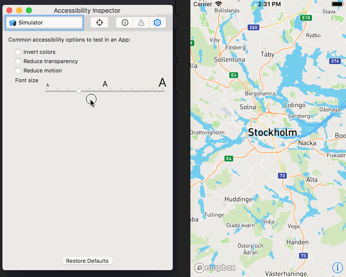

# iOS Dynamic Type support for any Mapbox GL Style

`ISHMapboxDynamicFontObserver` automatically adjusts all symbol layers in a
mapbox style to reflect the user's preferred content size setting.

The provided style is assumed to be designed for the content category
`UIContentSizeCategoryLarge`. All symbol layers' text sizes are scaled
according to the user's preferred content size setting. For layers that contain
a text size attribute and an icon image, the icon image is also scaled.

The observer listens to changes in the user's preferred content size setting and
automatically applies the setting on initialization, when the style changes or
when the setting changes.

It currently supports style values of the following types:

 - `MGLCameraStyleFunction`
 - `MGLConstantStyleValue`
